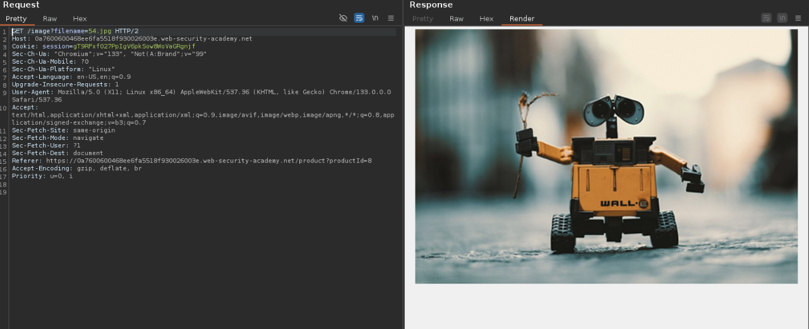
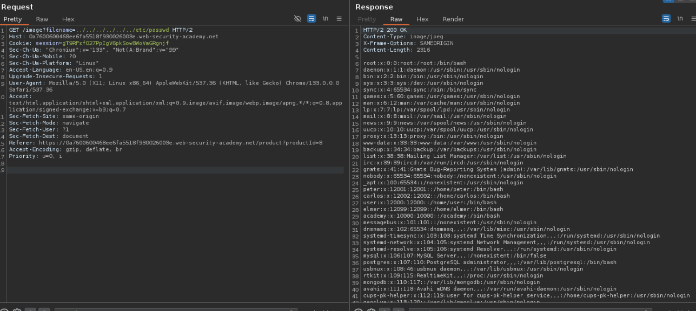

🇬🇧
# Path Traversal Exploitation

This section focuses on exploiting a **Path Traversal** vulnerability by manipulating the `$_GET` variable (`'filename'`) in the URL. Path Traversal occurs when an application does not properly sanitize user input, allowing attackers to access files outside the intended directory.


🇪🇸
# Explotación de Path Traversal

Esta sección se centra en explotar una vulnerabilidad de **Path Traversal** (también conocida como **Directory Traversal**) manipulando la variable `$_GET` (`'filename'`) en la URL. Esta vulnerabilidad ocurre cuando una aplicación no sanitiza correctamente la entrada del usuario, permitiendo a un atacante acceder a archivos fuera del directorio previsto.


🇬🇧
## How It Works
- The attacker injects directory traversal sequences, such as `../../../../../../etc/passwd`, into the `filename` parameter.
- These sequences navigate the server's filesystem, enabling access to sensitive files (e.g., `/etc/passwd` on Unix-based systems).
- The number of `../` sequences does not need to be exact. Even if you use more than necessary (e.g., 10), the system will still resolve the path correctly.

🇪🇸
## ¿Cómo funciona?
- El atacante inyecta secuencias de traversals, como `../../../../../../etc/passwd`, en el parámetro `filename`.
- Estas secuencias permiten navegar por el sistema de archivos del servidor, accediendo a archivos sensibles (por ejemplo, `/etc/passwd` en sistemas basados en Unix).
- El número de secuencias `../` no necesita ser exacto. Incluso si se usan más de las necesarias (por ejemplo, 10), el sistema seguirá resolviendo la ruta correctamente.

🇬🇧 
### Example
Given a vulnerable URL:
```
http://example.com/images/filename=../../../../../../directory

```

🇪🇸
### Ejemplo de una URL vulnerable por path traversal:
```
http://example.com/images/filename=../../../../../../directory

```

🇬🇧
## Lab: File path traversal, simple case :

This lab contains a path traversal vulnerability in the display of product images.

To solve the lab, retrieve the contents of the /etc/passwd file.


🇪🇸

## Laboratorio: File Path Traversal, caso simple:

### Descripción del laboratorio
Este laboratorio contiene una vulnerabilidad de **Path Traversal** en la visualización de imágenes de productos. El objetivo es explotar esta vulnerabilidad para recuperar el contenido del archivo `/etc/passwd`.


🇬🇧
The first step is to inspect the page to identify elements that can be exploited. In this case, we focus on the product images, as they could be vulnerable to **Path Traversal**.
After opening one, we encounter the following request:

🇪🇸

El primer paso es inspeccionar la página para identificar elementos que puedan ser explotados. En este caso, nos centramos en las imágenes de los productos, ya que podrían ser vulnerables a **Path Traversal**.
tras abrir una nos encontramos con esta peticion:



🇬🇧
Once the `filename` parameter has been identified in the intercepted request, we proceed to test if it is vulnerable to **Path Traversal**. To do this, we inject a traversal sequence into the image field with the goal of accessing the `/etc/passwd` file, which contains sensitive system information.

🇪🇸
Una vez identificado el parámetro `filename` en la solicitud interceptada, procedemos a probar si es vulnerable a **Path Traversal**. Para ello, inyectamos una secuencia de traversals en el campo de la imagen con el objetivo de acceder al archivo `/etc/passwd`, que contiene información sensible del sistema.



🇬🇧
If you have followed these steps correctly, you should now see the **lab completed flag**. This indicates that the Path Traversal vulnerability has been successfully exploited, and the lab objective has been achieved. Congratulations! 🎉

🇪🇸
Si has seguido estos pasos correctamente, ahora deberías ver la **flag de laboratorio completado**. Esto indica que la vulnerabilidad de Path Traversal ha sido explotada con éxito y que el objetivo del laboratorio se ha cumplido. ¡Felicidades! 🎉

